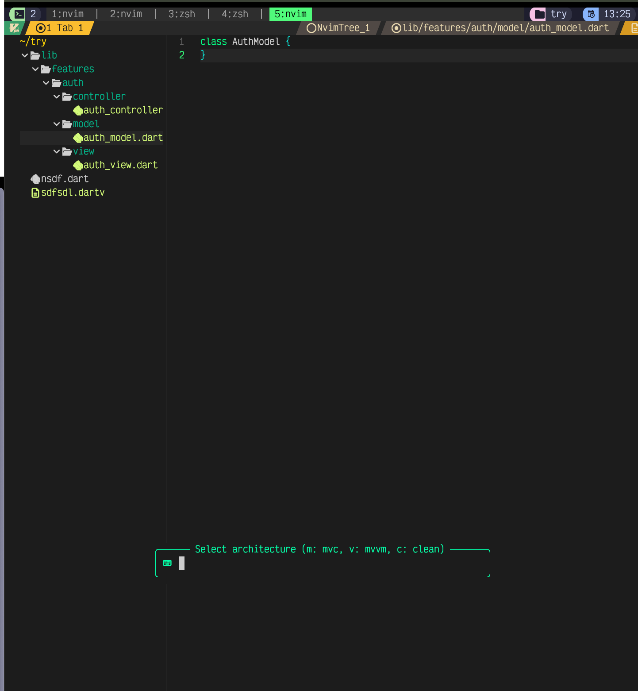
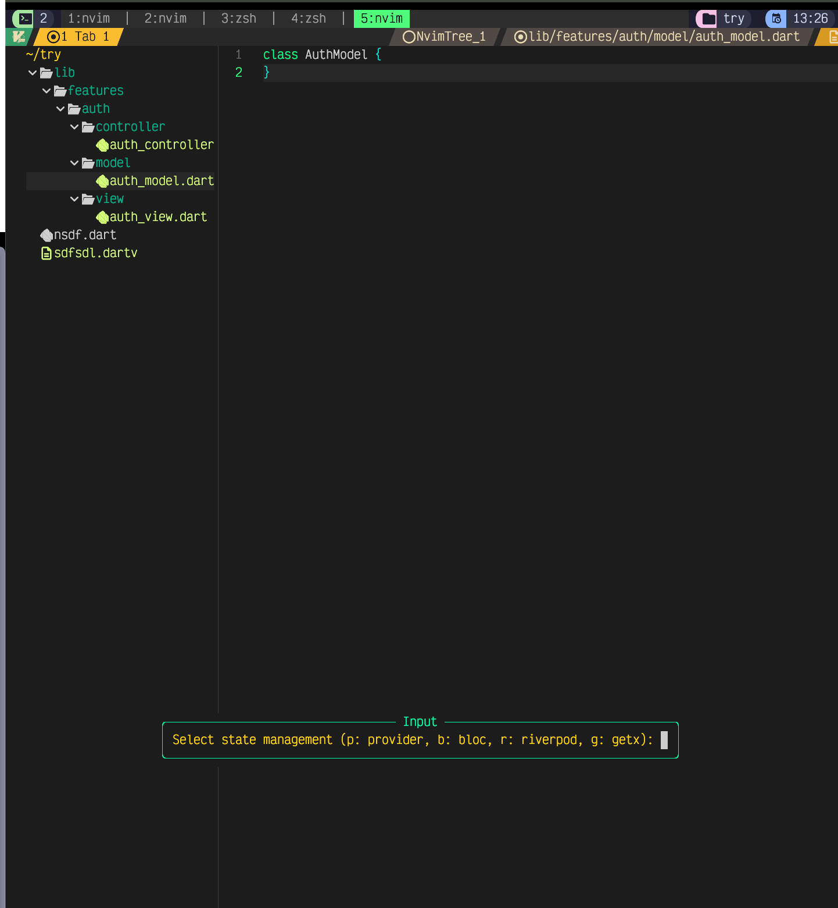
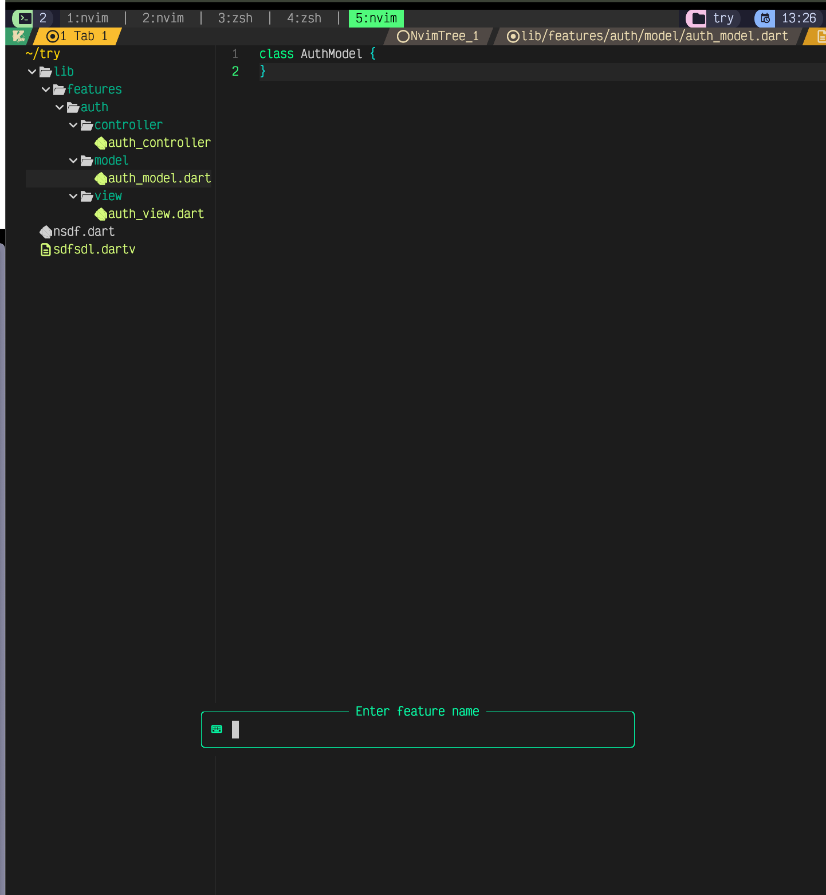
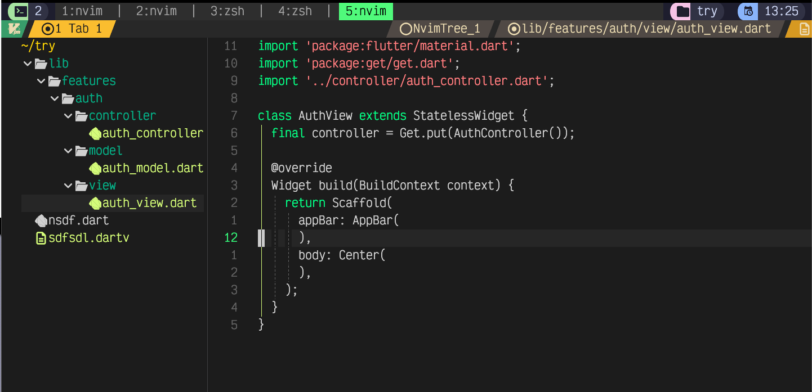
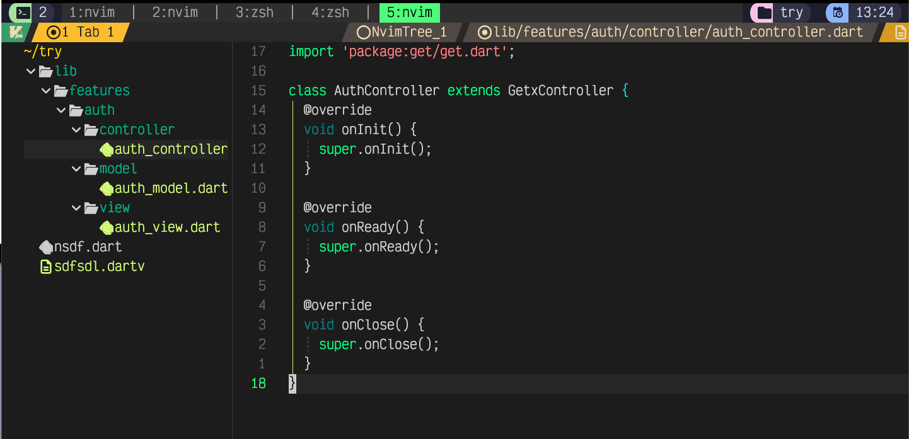

<div align="center">
  
  <p style="font-size: 20px; font-weight: bold;">
    Done by <span style="color: lightgreen;">Migbyte</span> Team
  </p>
</div>


# ArchFlow.nvim  
🚀 **Architecture + Flow = ArchFlow**  
Automate your Flutter project setup with ease!

```lua                                                                                                                                      
                                                   %%%%%%%%                   
                                   %%%%%%%         %%%%%%%%                   
                                   %%%%%%%%%         %%% %%%%                  
                                    %%%%%%#==        ====%%%%%                 
                                     %%%%%====     ====== %%%%%                
                                     %%%% ======= ======= %%%%%%%%            
                                     %%%%% ========== ====%%%%%%%%            
                                   %%%%%%%%====  ===   === %%%%%              
                                   %%%%%%%% ====       ==== %%%%              
                                       %%%%% ====       ====%%%%%             
                                        %%%%%====          %%%%%%%            
                                         %%%% %%%         %%%%%%%%%           
                                          %%%%%%%%         %%%%%%%            
                                          %%%%%%%%

                                                
      ___                       ___           ___           ___           ___           ___     
     /\__\          ___        /\  \         /\  \         |\__\         /\  \         /\  \    
    /::|  |        /\  \      /::\  \       /::\  \        |:|  |        \:\  \       /::\  \   
   /:|:|  |        \:\  \    /:/\:\  \     /:/\:\  \       |:|  |         \:\  \     /:/\:\  \  
  /:/|:|__|__      /::\__\  /:/  \:\  \   /::\~\:\__\      |:|__|__       /::\  \   /::\~\:\  \ 
 /:/ |::::\__\  __/:/\/__/ /:/__/_\:\__\ /:/\:\ \:|__|     /::::\__\     /:/\:\__\ /:/\:\ \:\__\
 \/__/~~/:/  / /\/:/  /    \:\  /\ \/__/ \:\~\:\/:/  /    /:/~~/~       /:/  \/__/ \:\~\:\ \/__/
       /:/  /  \::/__/      \:\ \:\__\    \:\ \::/  /    /:/  /        /:/  /       \:\ \:\__\  
      /:/  /    \:\__\       \:\/:/  /     \:\/:/  /     \/__/         \/__/         \:\ \/__/  
     /:/  /      \/__/        \::/  /       \::/__/                                   \:\__\    
     \/__/                     \/__/         ~~                                        \/__/    

```

---


# Table of Contents 📜  
1. [🌟 Why ArchFlow?](#why-archflow)  
2. [✨ Features](#features)
3. [⚙️ Screenshots](#screenshots)  
4. [⚙️ Installation](#installation)  
5. [🚀 Usage](#usage)  
6. [🔧 Configuration](#configuration)  
7. [📦 Dependencies](#dependencies)  
8. [📚 Advanced Topics](#advanced-topics)  
   * [📂 Custom Architecture Templates](#custom-architecture-templates)  
   * [🔌 State Management Integration](#state-management-integration)  
9. [📜 License](#license)  

---

# 🌟 Why ArchFlow?

💡 **ArchFlow.nvim** saves time and simplifies your Flutter development process by automating the repetitive task of setting up feature folders and boilerplate files. 

With **ArchFlow**, you can:  
- ⚡ Quickly set up a feature structure.  
- 📏 Maintain consistent architecture across your project.  
- 🌟 Integrate your favorite state management libraries.  
- 🚀 Focus on building features, not managing boilerplate.

---

# ✨ Features

### **📂 Architecture Selection**
Effortlessly generate feature structures for:  
   - `MVC`  
   - `MVVM`  
   - `Clean Architecture`

### **⚡ State Management Integration**
Supports seamless integration with:  
   - **Provider**  
   - **Riverpod**  
   - **BLoC**  
   - **Cubit**  
   - **GetX**


### **🛠 Customizable Templates**
Modify or extend boilerplate code to suit your needs.

### **📁 Quick Navigation**
Navigate recently created features with an integrated file navigator.

---

# 📸 Screenshots

Here are some screenshots showcasing the features and functionality of **ArchFlow.nvim**:

<div align="center">
  
  <p>✨ Automatically generated Clean Architecture structure</p>
</div>

<div align="center">
  
  <p>📂 Folder structure for MVC architecture</p>
</div>

<div align="center">
  
  <p>🔌 Integration with state management libraries</p>
</div>

<div align="center">
  
  <p>🔌 Boilerplate code for the view</p>
</div>

<div align="center">
  
  <p>🔌 Boilerplate code GetX controller</p>
</div>
---


# ⚙️ Installation

Install using **lazy.nvim** or your preferred plugin manager:

```lua
{
  "migbyte-0/archflow.nvim",
  config = function()
    require("archflow").setup({
      keybinding = "<leader>af", -- Optional: Change default keybinding
      debug = false,            -- Optional: Enable debug logs
    })
  end,
}
```

Alternatively, with **packer.nvim**:

```lua
use {
  "migbyte-0/archflow.nvim",
  config = function()
    require("archflow").setup()
  end,
}
```

---

# 🚀 Usage

1. Run `:ArchFlowGenerate` or use the keybinding `<leader>af`.  
2. Select an architecture (`MVC`, `MVVM`, or `Clean Architecture`).  
3. Choose a state management library (`Provider`, `Riverpod`, etc.).  
4. Enter a feature name (e.g., "Authentication").  
5. Watch ArchFlow generate the structure and boilerplate files in seconds! 🎉  

Example:  
```plaintext
// Clean Architecture folder structure for "Authentication":
- data/
  - repositories/
  - models/
- domain/
  - usecases/
  - entities/
- presentation/
  - screens/
  - blocs/
```

---

# 🔧 Configuration

You can customize ArchFlow.nvim by passing options to the `setup` function:

| Option         | Default        | Description                                                |
|----------------|----------------|------------------------------------------------------------|
| `keybinding`   | `<leader>af`   | Default keybinding to invoke the plugin.                  |
| `debug`        | `false`        | Enable debug logs for troubleshooting.                    |

---

# 📦 Dependencies

1. **Neovim** (>= 0.8.0)  
2. **Flutter SDK**  

---

# 📚 Advanced Topics

### 📂 Custom Architecture Templates

Customize your architecture setup by modifying the template files located in `lua/archflow/templates`.

### 🔌 State Management Integration

ArchFlow generates boilerplate files for your chosen state management library:  
   - **Provider**: `ChangeNotifier` classes.  
   - **Riverpod**: `StateNotifier` or `Provider` logic.  
   - **BLoC**: Event, state, and BLoC files.  
   - **Cubit**: Cubit logic files with states.  
   - **GetX**: Reactive controllers and bindings.  

---

# 📜 License

ArchFlow.nvim is distributed under the **MIT License**.  

```vbnet
MIT License

Copyright (c) 2025 Migbyte

Permission is hereby granted, free of charge, to any person obtaining a copy of this software and 
associated documentation files (the "Software"), to deal in the Software without restriction, 
including without limitation the rights to use, copy, modify, merge, publish, distribute, 
sublicense, and/or sell copies of the Software, and to permit persons to whom the Software is 
furnished to do so, subject to the following conditions:
```

---

# 🌟 Start Automating Today! 🚀  

Feel free to open PRs, issues, or share your feedback. Together, let’s simplify Flutter development!  
**ArchFlow on!** 🎨✨  
``` 

This README includes:  
- Creative and relevant ASCII art.  
- Emoji-based sections for an engaging layout.  
- Clearly structured headings and bullet points.  
It ensures a visually appealing and professional display on GitHub!
